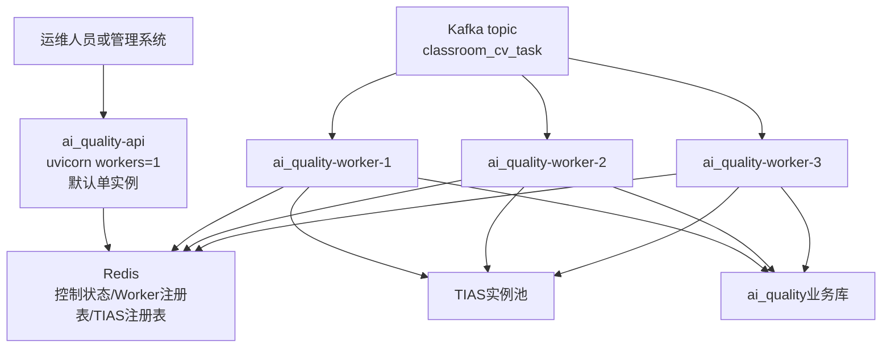
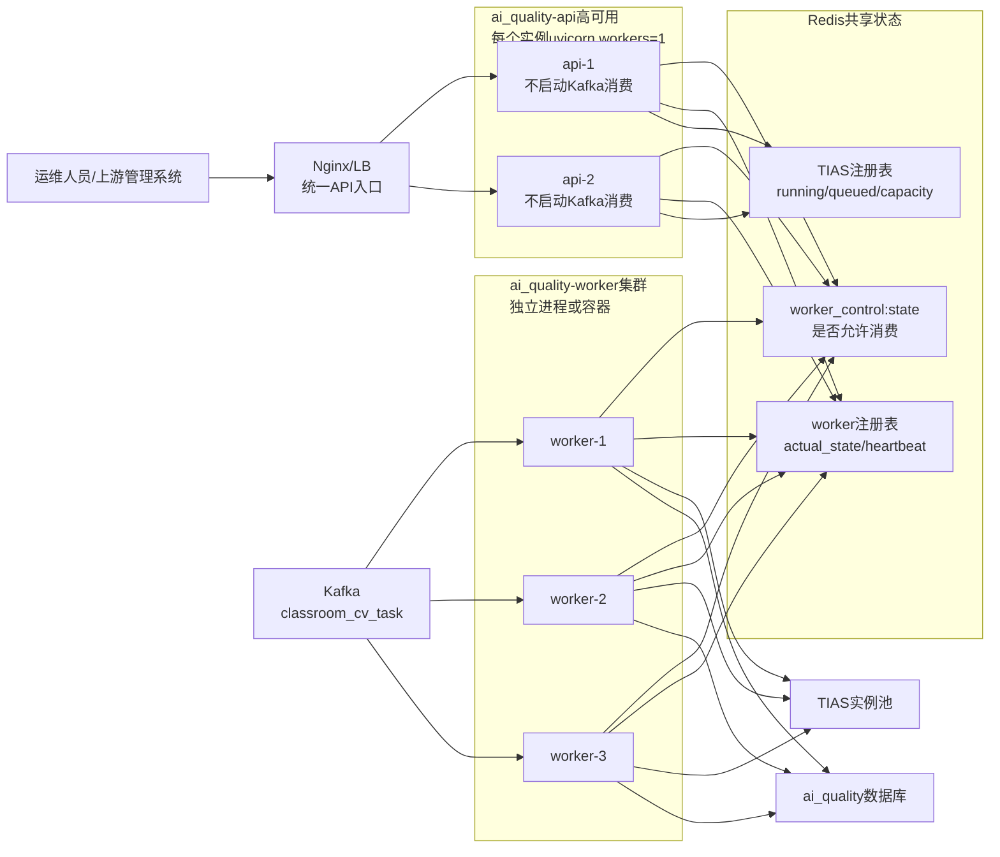
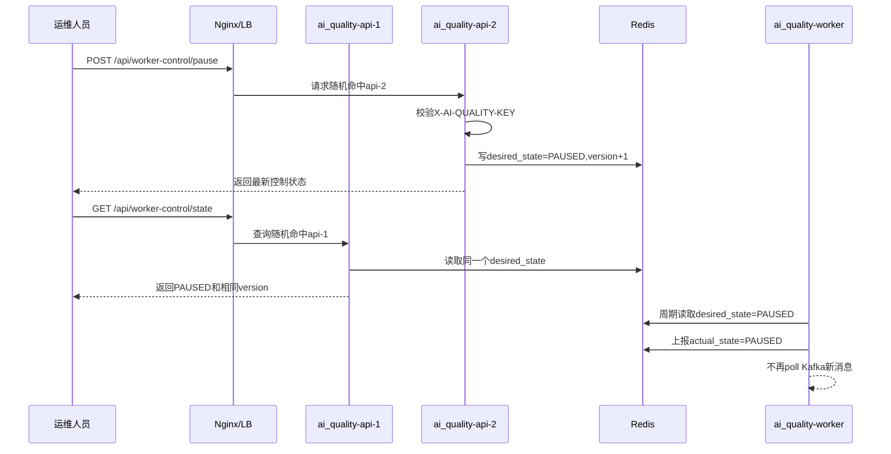
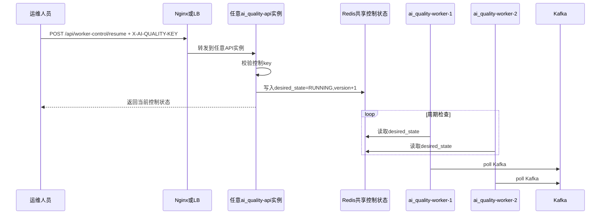
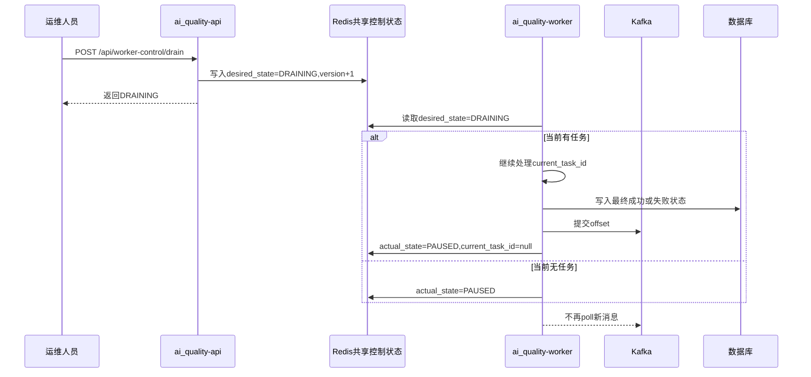
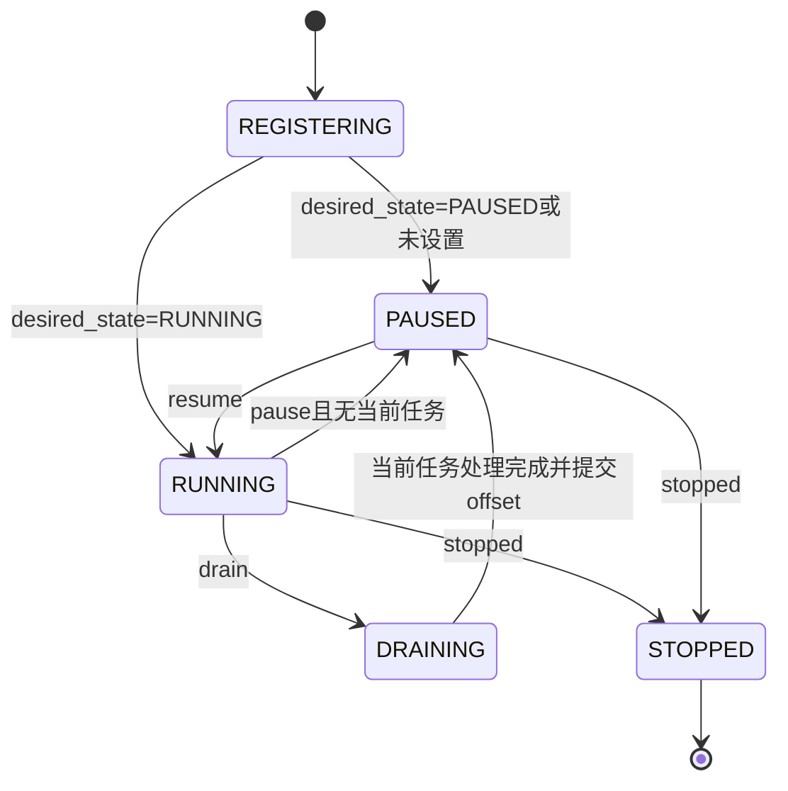
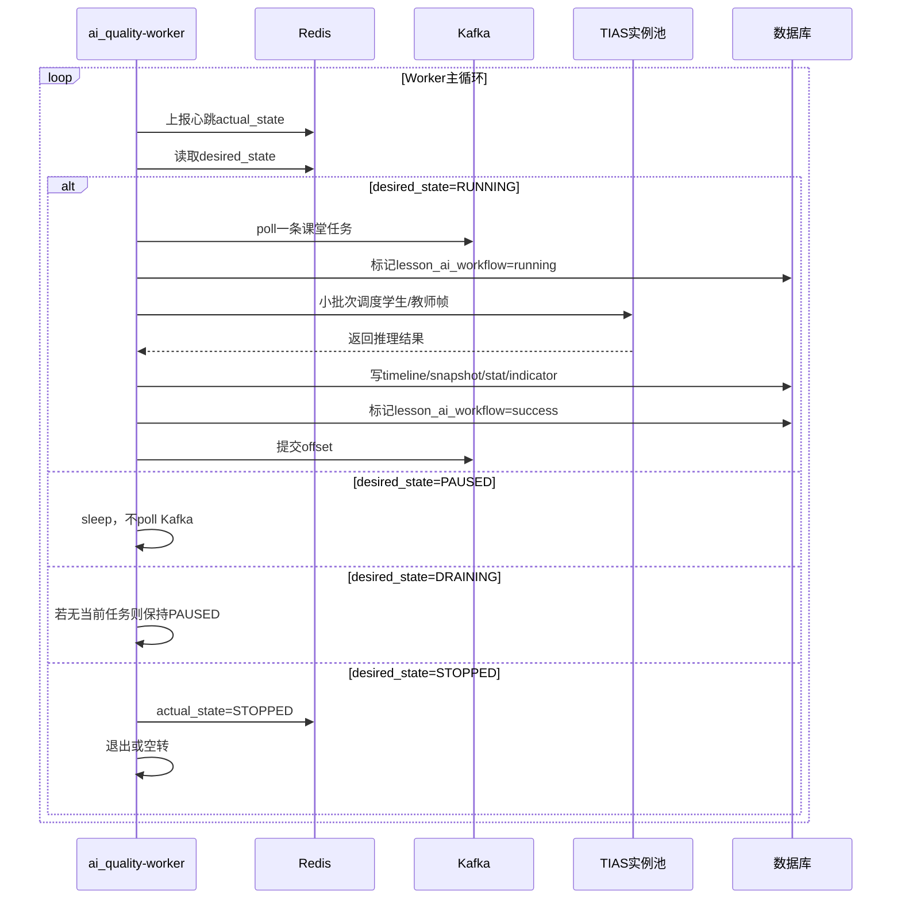

## Context

`ai_quality` 当前已经具备两个基础能力：

- FastAPI HTTP 入口：接收 TIAS 注册、心跳、注销。
- Kafka Worker 入口：通过 `consume` 命令直接消费 `classroom_cv_task`，处理视频、调度 TIAS、写业务表并提交 offset。

现在的问题不在于 `ai_quality` 能不能作为后端项目，而在于后续部署时，API 和 Worker 的运行职责不能混在同一个本地进程中。第一版 `ai_quality-api` 没有必要默认多实例，因为 API 只做 TIAS 注册心跳、状态查询和 Redis 控制状态写入，吞吐压力很小。真正需要横向扩容的是 `ai_quality-worker` 和 TIAS 实例池。

但是 API 即使先单实例部署，也应该从第一版开始按“无本地 consumer 状态”的控制面设计。这样后续如果需要双 API 高可用，或者上层通过 Nginx/LB 暴露统一入口，控制接口请求命中任意 API 实例时，都只读写 Redis 共享状态，不会退化成控制某个本地进程。

因此，本设计将 `ai_quality` 定义为同一个后端项目内的两个运行角色：

| 运行角色 | 中文说明 | 是否消费 Kafka | 是否暴露 HTTP |
| --- | --- | --- | --- |
| `ai_quality-api` | 控制面，提供 FastAPI 接口，查询和修改 Redis 共享状态 | 否 | 是 |
| `ai_quality-worker` | 执行面，独立进程或容器，注册心跳并按 Redis 控制状态消费 Kafka | 是 | 否 |

API 默认可以单实例部署；如需高可用可部署两个 API 实例。Worker 多实例负责真正消费 Kafka。两者通过 Redis 共享控制状态、Worker 注册表和 TIAS 注册表。

## Goals / Non-Goals

**Goals:**

- 将 `ai_quality` 整理为标准 FastAPI 后端结构，保留现有 CLI 入口兼容。
- 第一版推荐 `ai_quality-api` 单实例部署；如需高可用，可部署 2 个 API 实例并通过 Nginx/LB 统一入口访问。
- 支持 `ai_quality-api` 多实例能力，但不把多 API 作为第一版必选部署形态；单个 API 实例建议 `uvicorn --workers 1`。
- 支持 `ai_quality-worker` 多实例部署，Worker 进程独立于 API 进程，不随 API worker 数自动变化。
- 使用 Redis 保存 Worker 集群期望状态 `desired_state`，由 API 写、Worker 读。
- 使用 Redis 保存 Worker 运行状态 `actual_state` 和心跳，由 Worker 写、API 查。
- 新增 `resume`、`pause`、`drain`、`state`、`workers` 等控制和查询接口。
- 新增 TIAS 注册表查询接口，便于 API 侧直接查看当前可调度 TIAS 实例。
- 控制接口使用配置化 key 鉴权，默认不开启无鉴权控制。
- 保留现有 `consume` 入口行为兼容；新增推荐入口 `worker`。

**Non-Goals:**

- 不在本阶段实现由 API 远程创建或销毁 Worker 进程。Worker 进程数量仍由 Docker、systemd、Kubernetes、Supervisor 或人工启动控制。
- 不在本阶段改造 Kafka topic partition 数量；只在设计和文档中明确并发上限与 partition 的关系。
- 不在本阶段实现任务取消、课程级抢占、跨 Worker 任务迁移。
- 不在本阶段引入除 Redis 之外的新协调组件。
- 不在本阶段改变课堂质量指标算法、快照策略、数据库表口径和 TIAS 调度算法。

## Decisions

### 决策 1：API 是控制面，Worker 是执行面

`ai_quality-api` 不直接在 FastAPI startup 中启动 Kafka consumer。API 只暴露 HTTP 接口，负责修改 Redis 中的 Worker 集群期望状态，并查询 Worker/TIAS 注册表。

`ai_quality-worker` 是独立进程或容器。Worker 启动后注册自身、周期性心跳、读取 Redis 控制状态，并在 `desired_state=RUNNING` 时 poll Kafka。

备选方案：

- **API startup 自动启动 consumer**：本地最简单，但多 API 实例或 `uvicorn --workers > 1` 时会产生不可控的 consumer 数量。
- **API 通过接口启动本机 consumer 线程**：能满足单机演示，但请求随机落到任意 API 实例，只能控制局部进程，集群不可用。
- **API 写共享控制状态，Worker 自行收敛**：适合集群，控制面和执行面职责清晰，是本设计选择。

### 决策 2：控制接口使用状态语义，不使用进程语义

接口建议使用：

| 接口 | 语义 |
| --- | --- |
| `POST /api/worker-control/resume` | 设置集群期望状态为 `RUNNING`，允许 Worker 消费 Kafka |
| `POST /api/worker-control/pause` | 设置期望状态为 `PAUSED`，Worker 不再拉新消息 |
| `POST /api/worker-control/drain` | 设置期望状态为 `DRAINING`，当前任务跑完后暂停 |
| `GET /api/worker-control/state` | 查询当前期望状态和版本 |
| `GET /api/workers` | 查询所有 Worker 实例运行状态 |
| `GET /api/workers/{worker_id}` | 查询单个 Worker 实例运行状态 |

不建议叫 `/api/workers/start` 或 `/api/workers/stop`，因为它容易让人误解为 API 会启动或杀死进程。真实行为是修改 Redis 中的集群期望状态。

### 决策 3：Redis 中保存两类 Worker 状态

第一类是控制状态，由 API 写、Worker 读：

```json
{
  "desired_state": "RUNNING",
  "version": 12,
  "updated_at": "2026-07-01T18:00:00+08:00",
  "updated_by": "operator",
  "reason": "manual resume"
}
```

第二类是运行状态，由 Worker 写、API 查：

```json
{
  "worker_id": "worker-host1-001",
  "actual_state": "RUNNING",
  "desired_state": "RUNNING",
  "topic": "classroom_cv_task",
  "consumer_group": "cv-analysis-service",
  "assigned_partitions": [0],
  "current_task_id": "lesson-xxx",
  "current_partition": 0,
  "current_offset": 123,
  "processed_count": 20,
  "failed_count": 1,
  "last_error": null,
  "started_at": "2026-07-01T17:00:00+08:00",
  "last_heartbeat_at": "2026-07-01T18:00:05+08:00",
  "expires_at": "2026-07-01T18:00:20+08:00"
}
```

建议 Redis key：

| Key | 类型 | 中文说明 |
| --- | --- | --- |
| `ai_quality:worker_control:state` | String(JSON) | Worker 集群期望状态 |
| `ai_quality:workers` | Set | 当前已知 Worker ID 集合 |
| `ai_quality:worker:{worker_id}` | String(JSON) | 单个 Worker 最新运行状态，带 TTL |

### 决策 4：Worker 状态机以“是否拉新消息”为核心

状态定义：

| desired_state | Worker 行为 |
| --- | --- |
| `RUNNING` | 允许 poll Kafka，处理任务 |
| `PAUSED` | 不 poll Kafka，保持心跳；如果已经没有当前任务，actual_state 变为 `PAUSED` |
| `DRAINING` | 当前任务继续跑完，不再 poll 新消息；跑完后 actual_state 变为 `PAUSED` |
| `STOPPED` | 停止消费循环；进程可按配置退出或保持心跳为 `STOPPED` |

对于课堂视频这种长任务，`DRAINING` 比硬停更重要。Worker 处理中的课程任务不能被中断，否则 offset 未提交会导致后续重跑。

### 决策 5：API 默认单实例，按需双实例高可用

第一版推荐生产形态：

```text
ai_quality-api-1  uvicorn --workers 1

ai_quality-worker-1  python -m ai_quality.app worker
ai_quality-worker-2  python -m ai_quality.app worker
```

高可用形态：

```text
Nginx / LB
├── ai_quality-api-1  uvicorn --workers 1
└── ai_quality-api-2  uvicorn --workers 1

ai_quality-worker-1  python -m ai_quality.app worker
ai_quality-worker-2  python -m ai_quality.app worker
```

这里的 `uvicorn --workers 1` 只表示单个 `ai_quality-api` 实例内部的 Web worker 数量，不表示 Kafka Worker 数量。API 是轻量控制面，默认单实例足够；如果要解决 API 进程故障、发布重启或统一入口问题，再增加第二个 API 实例和 Nginx/LB。不要为了提升 Kafka 消费能力去增加 API 实例，Kafka 消费能力应通过 `ai_quality-worker` 扩容。

理由：

- API 是轻量控制面，主要是 Redis 读写，单实例通常足够。
- 真正重的是视频处理、Kafka 消费、TIAS 调度和数据库写入，这些都在 `ai_quality-worker`。
- `uvicorn --workers > 1` 时本地内存状态不可共享；虽然本方案关键状态都在 Redis，但单 worker 更容易排查和发布。
- 需要 API 高可用时，用 2 个 API 实例 + Nginx/LB，不建议在单实例里开多个 Uvicorn worker。

推荐生产拓扑：

| 组件 | 建议数量 | 是否暴露给 Nginx | 主要职责 |
| --- | --- | --- | --- |
| `ai_quality-api` | 默认 1 个；高可用 2 个 | 单实例时否；多实例时是 | 控制接口、查询 Redis 状态、TIAS 注册心跳入口 |
| `ai_quality-worker` | 按 Kafka partition 和 TIAS 吞吐配置 | 否 | 消费 Kafka、调度 TIAS、写业务表、上报 Worker 心跳 |
| Redis | 1 套高可用 Redis | 否 | 保存控制状态、Worker 注册表、TIAS 注册表 |
| TIAS | 按推理吞吐配置 | 否或内网访问 | 接收 ai_quality-worker 的小批次推理请求 |
| Nginx/LB | 可选；多 API 时 1 套入口 | 是 | 将 API 请求转发到多个 `ai_quality-api` 实例 |

Nginx 只负责转发 API 请求，不参与 Kafka 消费，也不直接代理 `ai_quality-worker`。单 API 部署时可以不需要 Nginx；多 API 高可用时，`/api/worker-control/resume`、`pause`、`drain` 请求无论命中哪个 API 实例，都只修改 Redis 共享控制状态。

### 决策 6：Kafka Worker 并发不等于 API 实例数

Kafka Worker 数量由以下因素决定：

```text
有效并发上限 ≈ min(Kafka partition 数, ai_quality-worker 数, TIAS 可用吞吐)
```

如果 `classroom_cv_task` 只有 1 个 partition，同 consumer group 启动 4 个 Worker，通常也只有 1 个 Worker 被分配 partition，其余空闲。因此后续要多节课并行，必须同时评估 topic partition、Worker 数、TIAS 实例容量和数据库写入能力。

示例：

| API 实例数 | 单 API Uvicorn workers | ai_quality-worker 数 | Kafka partition 数 | 预期说明 |
| --- | --- | --- | --- | --- |
| 1 | 1 | 1 | 1 | 第一版最小生产形态，API 单实例，Kafka 单任务消费 |
| 1 | 1 | 4 | 4 | API 不扩容，Worker 可并行消费，前提是 TIAS 容量足够 |
| 2 | 1 | 1 | 1 | API 高可用，Kafka 仍单任务消费 |
| 2 | 1 | 4 | 1 | 只有 1 个 Worker 真正消费，其余空闲 |
| 2 | 1 | 4 | 4 | 最多 4 个 Worker 并行消费，仍受 TIAS 容量约束 |

### 决策 7：控制接口必须鉴权

控制接口会影响 Kafka 消费状态，必须带 key。第一版使用配置化共享 key：

```toml
WorkerControlEnabled = true
WorkerControlKey = "change-me"
WorkerControlHeaderName = "X-AI-QUALITY-KEY"
```

请求示例：

```http
POST /api/worker-control/drain
X-AI-QUALITY-KEY: change-me
```

未启用控制接口时返回 404 或 403；key 缺失或错误时返回 401/403，并记录简洁安全日志，不打印 key 原文。

### 决策 8：保留兼容入口，新增推荐入口

保留：

```bash
python -m ai_quality.app consume
```

新增推荐：

```bash
python -m ai_quality.app worker
```

`consume` 可作为兼容别名，默认可继续“直接 RUNNING 消费”或进入受控模式需由配置决定。推荐配置：

```toml
WorkerControlledByRedis = true
WorkerDefaultDesiredState = "PAUSED"
```

本地开发可选新增：

```bash
python -m ai_quality.app all
```

`all` 只用于本地单进程开发，不作为生产部署方式。

### 决策 9：部署资产按服务收敛到 docker 目录

为避免部署文件继续散落在项目根目录或服务根目录，本阶段补充两个目录：

```text
ai_quality/docker/
├── Dockerfile
├── docker-compose.yml
├── env.example
├── nginx.conf.example
└── README.md

tias/docker/
├── Dockerfile
├── Dockerfile.cuda113
├── docker-compose.yml
├── env.example
└── README.md
```

`ai_quality/docker/` 负责 ai_quality 服务自身部署，不放 TIAS 模型文件，不放测试视频，不放数据库脚本。建议同一个镜像通过启动命令区分 API 和 Worker：

| 文件 | 中文说明 |
| --- | --- |
| `Dockerfile` | 构建 ai_quality 运行镜像，安装 API 和 Worker 共同依赖 |
| `docker-compose.yml` | 本地或测试环境启动 Redis、ai_quality-api、ai_quality-worker 的示例 |
| `env.example` | Kafka、Redis、DB、Worker 控制 key、日志级别、挂载路径等环境变量示例 |
| `nginx.conf.example` | 可选双 API 高可用时的 Nginx upstream 示例 |
| `README.md` | 说明 API 单实例、Worker 多实例、Redis、Kafka、TIAS 地址等启动方式 |

`tias/docker/` 负责 TIAS 推理服务部署，保留 CPU 和 CUDA 镜像构建入口。当前 `tias/Dockerfile`、`tias/Dockerfile_cuda113` 已存在，实施时可以迁移到 `tias/docker/`，也可以先复制并在旧位置保留兼容说明，避免已有脚本立即失效。

| 文件 | 中文说明 |
| --- | --- |
| `Dockerfile` | 构建 TIAS CPU 或默认运行镜像 |
| `Dockerfile.cuda113` | 构建 CUDA 11.3 运行镜像，承接现有 `Dockerfile_cuda113` |
| `docker-compose.yml` | 本地或测试环境多开 TIAS 实例示例，配置不同端口和 `InstanceId` |
| `env.example` | ai_quality 注册地址、TIAS 监听端口、并发、队列、心跳间隔等环境变量示例 |
| `README.md` | 说明 TIAS 单实例和多实例启动、注册 ai_quality、模型挂载和日志查看 |

部署目录只承载部署资产，不改变 Python 包导入路径；实施时要同步更新运行文档中的命令路径。

## Mermaid DSL

### 推荐生产部署结构



### 可选双 API 高可用入口



### 双 API 时 Nginx 随机命中任意 API 的控制一致性



### resume 控制时序



### drain 控制时序



### Worker 状态机



### Worker 消费循环



## Risks / Trade-offs

| 风险 | 缓解 |
| --- | --- |
| Redis 不可用会导致控制状态和注册表不可读 | Worker 在 Redis 短暂不可用时不拉新 Kafka 消息，保留当前任务处理；API 返回明确错误 |
| 控制接口被误调用导致全局暂停 | 使用配置化 key 鉴权，记录操作人和 reason；生产接入网关权限控制 |
| `STOPPED` 与进程退出语义混淆 | 第一版文档明确 `STOPPED` 是停止消费循环，不等于部署系统销毁进程 |
| Worker 数大于 Kafka partition 后并发不提升 | 文档和状态接口暴露 partition/worker 数；扩容前评估 topic partition |
| DRAINING 时长较长 | 课堂视频任务本身耗时长，接口返回状态后由 `/api/workers` 查询 current_task_id 和耗时 |
| 多 API 实例同时写控制状态 | 该风险只存在于可选双 API 高可用形态；使用 Redis 原子递增版本号或事务，响应返回新版本；后写覆盖前写 |
| 现有 `consume` 行为被破坏 | 保留 `consume` 兼容入口，新增 `worker` 作为推荐入口，迁移文档分阶段引导 |
| Docker 文件迁移导致旧脚本失效 | 先保留根目录旧 Dockerfile 或提供兼容说明；文档统一推荐新 `docker/` 路径 |

## Migration Plan

1. 新增 FastAPI 结构，不移除 `ai_quality/http_app.py`，让旧入口继续可用。
2. 新增 Redis Worker 控制状态和注册表模块，先覆盖单元测试。
3. 新增 API 路由：健康检查、TIAS 注册表查询、Worker 控制、Worker 查询。
4. 将 Kafka 消费循环封装为可暂停/恢复/排空的 Worker 服务。
5. 新增 `worker` CLI 命令，保留 `consume` 兼容。
6. 新增 `ai_quality/docker/` 和 `tias/docker/` 部署目录，集中 Dockerfile、compose、env 示例和 README。
7. 更新 `ai_quality/RUNNING.md`、`tias/RUNNING.md` 和部署文档，说明 API 单实例、可选高可用、Worker 集群和 TIAS 多实例启动方式。
8. 本地用 1 个 API、2 个 Worker、4 个 TIAS 验证控制状态切换。
9. 如需要验证高可用，再用 2 个 API 实例通过 Nginx 入口验证请求随机落点下的控制一致性。

回滚策略：

- 保留 `consume` 旧入口，可直接绕过控制面继续按当前方式消费。
- 若新控制接口异常，可关闭 `WorkerControlEnabled`，只保留注册表查询和健康检查。

## Open Questions

- 第一版 `STOPPED` 是否让 Worker 进程退出，还是保持心跳但不消费？建议默认保持进程存活，后续由部署系统控制退出。
- 是否要把控制操作记录落库审计？第一版可先写 Redis 当前状态和日志，后续补审计表。
- `consume` 兼容入口是否默认进入受控模式？建议第一版 `consume` 保持旧行为，`worker` 使用受控模式。
