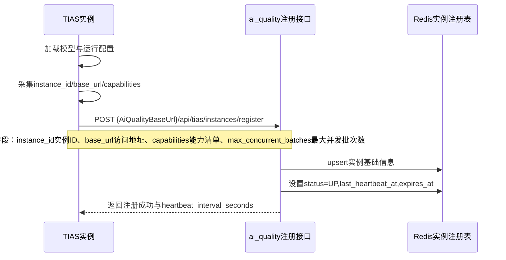
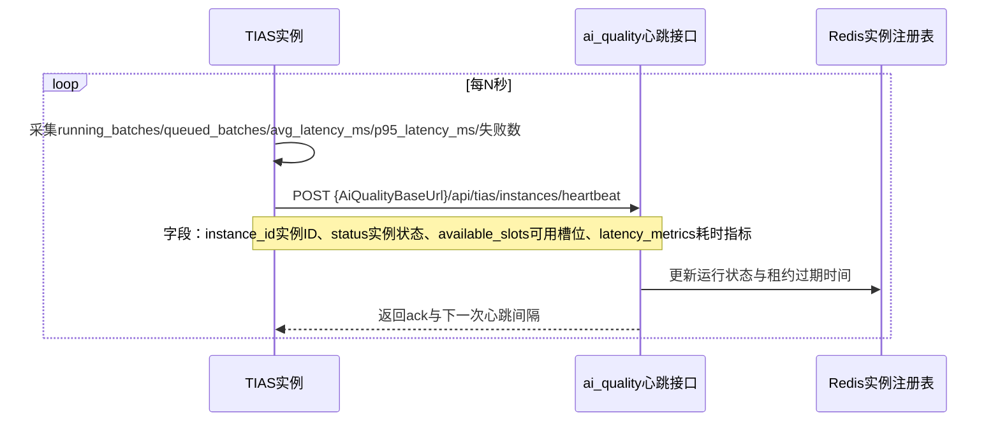
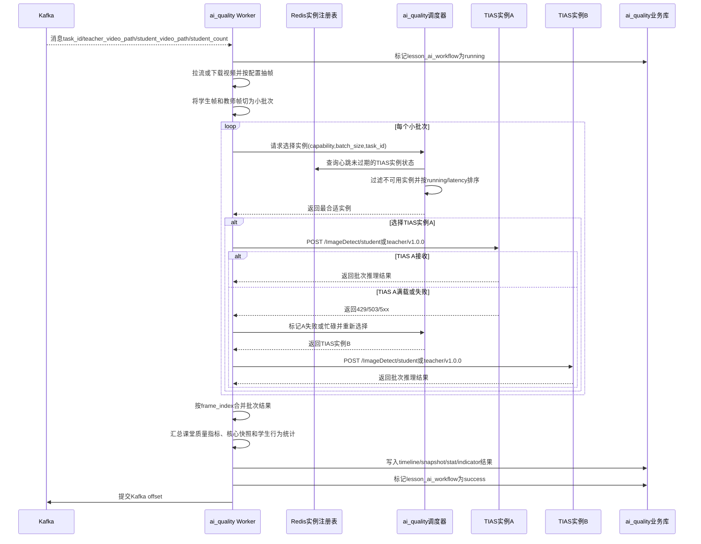
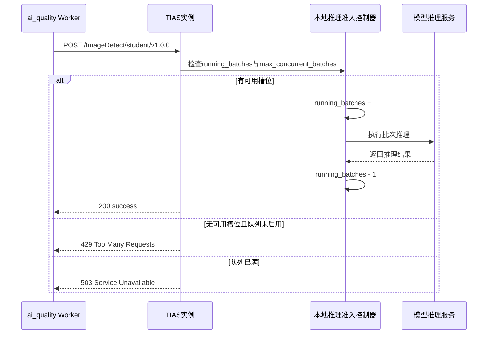

## 背景

当前项目中 `ai_quality` 已作为课堂质量视觉分析 Worker 存在，负责消费 Kafka、处理课程视频、汇总指标、保存核心快照并写入质量评价相关业务表。但它当前不是 FastAPI 后端服务，而是 CLI/Worker 入口：`consume` 用于监听 Kafka，`run-json` 用于模拟单条任务。推理层仍直接依赖当前 `app.services.student_behavior_service` 和 `app.services.teacher_behavior_service`，本质上是同代码库本地调用，不能把多个 TIAS 推理服务作为独立资源池调度。

6.0 设计要求将 `ai_quality` 与当前 `app` 推理服务拆成两个独立服务，其中当前 `app/` 目录和包名需要迁移为 `tias/`。`ai_quality` 只负责课堂质量任务编排和指标入库，`tias` 只负责模型推理、实例状态上报、本地准入控制和运维接口。

当前 TIAS 接口清单如下：

| 当前接口 | 方法 | 当前功能 | 6.0 建议 |
| --- | --- | --- | --- |
| `/AE/SyncTasks` | POST | 旧 IAS 同步图片任务，基于 `TaskInfo`、区域规则、人数/抬头检测 | 保留代码能力，通过配置控制是否暴露；课堂质量链路不使用 |
| `/AE/SyncTasks2` | POST | 旧 IAS 同步图片任务的 base64 变体 | 保留代码能力，通过配置控制是否暴露；课堂质量链路不使用 |
| `/AE/Capacity` | GET | 返回智能分析能力信息，但当前是示例容量值 | 移除；不得用于 6.0 调度 |
| `/AE/Capacity_v2` | GET | 返回连接数、处理图片数、运行时间，但任务容量仍不是准确队列状态 | 移除；由注册心跳和 `/AE/WorkerStatus` 替代 |
| `/ImageDetect/student/v1.0.0` | POST | 学生行为分析，当前为串行执行人数、抬头、行为模型 | 保留路径，但实现替换为当前 `/ImageDetect/student/v1.0.1` 的并行逻辑 |
| `/ImageDetect/student/v1.0.1` | POST | 学生行为分析，三类模型并行推理，包含 `person_count.pt`、`face_count.pt`、`student.pt` | 移除接口地址，能力迁移到 `/ImageDetect/student/v1.0.0` |
| `/ImageDetect/teacher/v1.0.0` | POST | 教师行为分析，支持可选头姿结果 | 保留 |
| `/AE/Version` | GET | 获取算法版本信息 | 移除；版本信息放入注册和心跳字段 |
| `/AE/LogLevel` | GET/PUT | 查询和设置日志等级 | 移除；日志级别通过配置或启动参数控制 |

## 目标与非目标

**目标：**

- 建立 `ai_quality` 与 `tias` 的独立服务边界，禁止 `ai_quality` 直接 import `app.*` 或 `tias.services.*` 完成推理。
- 将当前 `app/` 代码目录、包名和服务入口迁移为 `tias/`，同步调整启动脚本、Dockerfile、测试脚本、配置样例和模型路径。
- 为 `ai_quality` 新增 FastAPI HTTP 入口，用于接收 TIAS 注册、心跳和注销。
- 设计 TIAS 6.0 的最小对外接口面，裁剪旧 Capacity、Version、LogLevel 和重复学生接口，保留课堂质量推理接口。
- 设计 TIAS 主动注册、心跳、下线和真实状态上报机制。
- 设计 `ai_quality` 消费 Kafka 后的小批次级负载均衡调度机制。
- 明确 TIAS 第一版如何上报处理中批次、排队批次、最大并发、最大队列、平均耗时、P95 耗时和失败计数等调度字段。
- 明确 `ai_quality` 如何基于状态字段进行实例选择、失败重试、熔断和结果合并。
- 提供 Mermaid DSL 时序图，用于评审注册、心跳和 Kafka 任务调度链路。

**非目标：**

- 不在本变更中重新定义课堂质量指标算法和评分规则。
- 不在第一阶段引入独立消息队列作为 TIAS 内部推理队列；TIAS 先用本地准入和可选本地等待队列。
- 不要求第一阶段实现跨机 GPU 抢占、任务取消、优先级调度和异步回调。
- 不要求第一阶段接入完整监控平台，也不采集 CPU、内存、GPU、显存等硬件指标。
- 不要求第一阶段保留旧 IAS 接口的完全兼容；如仍有外部依赖，通过配置开关进入兼容模式。

## 设计决策

### 决策 0：`app` 不只改服务名，代码包和启动入口也迁移为 `tias`

6.0 中 `app` 改成 `tias` 应按服务边界迁移理解，而不是只改展示名称。目标状态如下：

| 当前项 | 6.0 目标 | 中文说明 |
| --- | --- | --- |
| `app/` | `tias/` | TIAS 推理服务代码目录 |
| `app.main:app` | `tias.main:app` | FastAPI 启动入口 |
| `from app...` | `from tias...` | TIAS 内部模块引用 |
| `app/models` | `tias/models` | 模型文件默认目录 |
| `app/vendor/DirectMHP` | `tias/vendor/DirectMHP` | 教师头姿依赖默认目录 |
| `app/config.toml` | `tias/config.toml` 或独立部署配置 | TIAS 服务配置文件 |

迁移原则：

- 正式代码中不再新增 `app.*` 引用，TIAS 内部统一使用 `tias.*`。
- `ai_quality` 不通过 `app.*` 或 `tias.*` import 调用推理逻辑，只通过 HTTP 调用 TIAS。
- Dockerfile、`start.sh`、README、测试脚本和本地运行命令必须同步迁移到 `tias` 入口。
- 短期如确实需要兼容旧脚本，可以保留极薄的兼容入口，但兼容入口不得成为 6.0 正式依赖，且需要在迁移完成后清理。
- 迁移完成后用 `rg "from app|import app|app.main|app/models|app/vendor"` 做收口检查。

### 决策 1：使用“小批次级”调度，而不是课程级或单帧级

`ai_quality` 收到 Kafka 课程任务后先抽取学生视频帧和教师视频帧，再按固定批大小切分为小批次，例如每批 4、8 或 16 张。每个批次独立选择 TIAS 实例，结果按 `task_id + stream_type + frame_index` 合并回课程维度。

备选方案：

- 课程级调度：一节课固定交给一个 TIAS。实现简单，但无法让单节课利用多个 TIAS 实例，负载不均时处理慢。
- 单帧级调度：每帧独立选择 TIAS。负载最均衡，但 HTTP 调用多，状态查询和重试开销大。
- 小批次级调度：在负载均衡和调用开销之间折中，适合作为 6.0 第一版。

最终选择小批次级，默认 `TiasBatchSize=8`，可配置。

### 决策 1.1：ai_quality 不操作 lesson_ai_job，只维护 lesson_ai_workflow

`lesson_ai_job` 是上游生产者服务负责的任务主表，`ai_quality` 不插入、不更新、不改状态，也不把它作为本服务的状态写入目标。`ai_quality` 只维护本服务相关的 `lesson_ai_workflow`，并在 workflow 中记录视觉分析处理状态、失败阶段、失败原因、开始时间、结束时间和耗时等信息。

职责边界：

| 表 | 负责方 | ai_quality 6.0 行为 |
| --- | --- | --- |
| `lesson_ai_job` | 上游生产者服务 | 不操作；只可按必要场景只读关联，不写入状态 |
| `lesson_ai_workflow` | ai_quality | 写入 running、success、failed 等工作流状态和失败原因 |
| `lesson_behavior_timeline` | ai_quality | 写入课堂行为时间线 |
| `lesson_snapshot_event` | ai_quality | 写入核心快照事件 |
| `lesson_student_behavior_stat` | ai_quality | 写入学生行为统计 |
| `indicator_score_result` | ai_quality | 写入指标得分结果 |

Kafka offset 提交口径也随之明确：课程任务成功写入 `lesson_ai_workflow` 最终成功状态，或达到最终失败并把失败状态写入 `lesson_ai_workflow` 后，才提交 Kafka offset。`lesson_ai_job` 不参与 ai_quality 的提交判定。

### 决策 2：TIAS 主动向 ai_quality 统一入口注册，Redis 作为共享实例注册表

TIAS 启动后调用 `ai_quality` 统一入口的注册接口，上报 `instance_id`、`base_url`、能力清单、并发能力和队列配置。之后按固定心跳间隔向同一个统一入口上报实时状态。`ai_quality` 将实例信息写入 Redis 注册表，而不是写入单进程内存。

如果 `ai_quality` 部署多个实例，Kafka 任务可能被任意 `ai_quality` 实例消费。注册状态若只在某个进程内存中，会导致其他 `ai_quality` 实例看不到 TIAS 状态，调度不稳定。因此注册表必须是多 `ai_quality` 实例共享的。

TIAS 不需要、也不应向多个 `ai_quality` 实例端口分别注册。生产部署应提供一个稳定的 `ai_quality` 入口地址，例如 Nginx、Kubernetes Service、Docker Compose service name、VIP 或单机固定端口。TIAS 只配置 `AiQualityBaseUrl`，由统一入口将请求转发给任意 `ai_quality` HTTP 实例；该实例写 Redis 后，所有 `ai_quality` worker 都能读取同一份 TIAS 状态。

TIAS 配置示例：

```toml
[TIAS]
InstanceId = "tias-8981"
BaseUrl = "http://10.67.65.8:8981"
AiQualityBaseUrl = "http://ai-quality:9000"
HeartbeatIntervalSeconds = 5
HeartbeatTimeoutSeconds = 15
MaxConcurrentBatches = 1
MaxQueueSize = 0
```

Redis key 建议：

| Key | 类型 | 中文说明 |
| --- | --- | --- |
| `ai_quality:tias:instances` | Set | 保存当前已知的 TIAS `instance_id` 集合 |
| `ai_quality:tias:instance:{instance_id}` | String(JSON) 或 Hash | 保存单个 TIAS 实例的最新注册和心跳状态，并设置 TTL |

心跳写入规则：

- `SADD ai_quality:tias:instances {instance_id}`。
- `SET ai_quality:tias:instance:{instance_id} {json} EX {heartbeat_timeout_seconds}`。
- 调度读取时，如果实例 ID 在集合中但状态 key 已过期，则跳过该实例，并可异步清理集合中的残留 ID。

建议注册表字段：

| 字段 | 中文注释 |
| --- | --- |
| `instance_id` | TIAS 实例唯一标识，建议包含主机、端口、进程或容器编号 |
| `base_url` | TIAS 实例 HTTP 根地址，例如 `http://10.67.65.8:8981` |
| `service_version` | TIAS 服务版本，例如 `6.0.0` |
| `model_version` | 模型版本摘要，可包含学生、教师、头姿模型版本 |
| `capabilities` | 能力清单，例如学生行为、教师行为、教师头姿 |
| `max_concurrent_batches` | 本实例最大并发批次数 |
| `running_batches` | 当前正在推理的批次数 |
| `queued_batches` | 当前本地等待队列中的批次数 |
| `max_queue_size` | 本地最大等待队列长度；`0` 表示不开启本地排队 |
| `available_slots` | 当前可接收批次数，通常为 `max_concurrent_batches - running_batches` |
| `avg_latency_ms` | 最近窗口内单批次平均推理耗时 |
| `p95_latency_ms` | 最近窗口内单批次 P95 推理耗时 |
| `success_count` | 启动以来成功处理批次数 |
| `failure_count` | 启动以来失败批次数 |
| `recent_failure_count` | 最近窗口内失败批次数 |
| `last_error` | 最近一次错误摘要 |
| `status` | 实例状态：`UP`、`BUSY`、`DRAINING`、`DOWN`、`UNKNOWN` |
| `last_heartbeat_at` | ai_quality 收到最后一次心跳的时间 |
| `expires_at` | 心跳租约过期时间，超过后实例不可调度 |

### 决策 3：TIAS 状态接口与推理接口都必须参与稳定性保护

`ai_quality` 查询 TIAS 状态只能作为调度参考，不能作为唯一准入依据。多个 `ai_quality` worker 可能同时看到同一个 TIAS 有空闲槽位并同时下发批次，所以 TIAS 推理接口必须在本地再次检查并发状态。

TIAS 本地准入规则：

- `running_batches < max_concurrent_batches` 时接收请求，并增加运行中计数。
- `running_batches >= max_concurrent_batches` 且本地队列未启用时，返回 `429 Too Many Requests`。
- 本地队列启用且 `queued_batches < max_queue_size` 时，可进入等待队列。
- 本地队列满时返回 `503 Service Unavailable`。
- 请求完成或异常时必须释放运行中计数。
- `max_concurrent_batches` 和 `max_queue_size` 必须释放到 TIAS 的 `config.toml`；`max_queue_size = 0` 表示不开启本地排队等待。

### 决策 4：ai_quality 调度采用“健康过滤 + 简单排序 + 本地预留”

调度器选择实例时先过滤，再排序。第一版不引入复杂权重和硬件指标，优先使用 TIAS 自身上报的并发与队列状态。

过滤条件：

- 实例心跳未过期。
- `status` 为 `UP` 或可接受的 `BUSY`。
- 实例具备批次所需能力，例如 `student_behavior` 或 `teacher_behavior`。
- 实例未处于熔断冷却期。
- 第一版默认不开启 TIAS 本地队列，优先过滤掉 `running_batches >= max_concurrent_batches` 的实例。

建议排序规则：

```text
可接收实例 = running_batches < max_concurrent_batches

优先级 =
  1. running_batches 最小
  2. 本 ai_quality 进程内近期选择次数更少
  3. avg_latency_ms 更低
  4. p95_latency_ms 更低
  5. queued_batches 更低
  6. recent_failure_count 更低
```

字段中文说明：

- `running_batches`：正在处理的批次数，越少越优先。
- 本进程近期选择次数：只在单个 `ai_quality` 进程内生效，用于让同等空闲实例轮转，避免空闲实例因为没有延迟样本长期不被选择。
- `avg_latency_ms`：最近窗口内平均批次耗时，越低越优先。
- `p95_latency_ms`：最近窗口内 P95 批次耗时，用于避免尾延迟过高的实例。
- `queued_batches`：本地排队批次数，第一版默认应为 `0`。
- `recent_failure_count`：近期失败次数，超过阈值时直接熔断过滤。

如果所有实例都满载，`ai_quality` 不应立刻提交 Kafka offset，也不应将任务判定为最终失败；它应按配置等待后重试。只有课程任务最终成功落库，或达到最大重试/最大等待后失败状态落库，才提交 Kafka offset。

选中实例后在 `ai_quality` 调度器内做本地短期预留，避免同一进程内多个并发批次同时选择同一个实例。跨进程竞争仍由 TIAS 本地准入兜底。

### 决策 5：TIAS 6.0 接口收敛为推理、状态、注册心跳和运维接口

建议 TIAS 6.0 对外接口：

| 目标接口 | 方法 | 是否保留 | 中文说明 |
| --- | --- | --- | --- |
| `/ImageDetect/student/v1.0.0` | POST | 保留路径，替换实现 | 学生画面推理，使用当前 `/ImageDetect/student/v1.0.1` 的并行逻辑，返回人数、抬头人数、睡觉、玩手机、阅读等计数和框 |
| `/ImageDetect/teacher/v1.0.0` | POST | 保留 | 教师画面推理，返回教师行为和头姿结果 |
| `/AE/WorkerStatus` | GET | 新增 | 返回 TIAS 实例实时运行状态、队列状态和耗时指标 |
| `/AE/Health` | GET | 新增 | 轻量健康检查，只判断进程和模型是否可服务 |
| `/AE/Drain` | PUT | 新增 | 进入排空状态，不再接收新批次，用于发布或下线 |

建议移除或默认隐藏：

| 当前接口 | 裁剪建议 | 原因 |
| --- | --- | --- |
| `/AE/SyncTasks` | 保留代码，默认不暴露接口地址 | 旧 IAS 协议，课堂质量链路不需要；如有外部依赖可配置暴露 |
| `/AE/SyncTasks2` | 保留代码，默认不暴露接口地址 | 旧 IAS 协议，课堂质量链路不需要；如有外部依赖可配置暴露 |
| `/AE/Capacity` | 移除 | 返回值不能代表真实调度状态 |
| `/AE/Capacity_v2` | 移除 | 指标不完整，不能准确反映队列状态 |
| `/ImageDetect/student/v1.0.1` | 移除接口地址 | 能力迁移到 `/ImageDetect/student/v1.0.0` |
| `/AE/Version` | 移除 | 版本信息改由注册/心跳字段上报 |
| `/AE/LogLevel` | 移除 | 日志等级通过配置或启动参数控制 |

### 决策 6：批次请求字段必须能追踪、重试和合并

学生批次请求建议字段：

| 字段 | 中文注释 |
| --- | --- |
| `request_id` | 本次 HTTP 请求唯一标识，用于日志追踪 |
| `task_id` | Kafka 课程任务 ID |
| `batch_id` | 小批次 ID，建议稳定生成 |
| `stream_type` | 视频流类型，学生流固定为 `student` |
| `frames` | 帧列表 |
| `frames[].frame_id` | 帧唯一 ID，建议包含流类型和帧序号 |
| `frames[].frame_index` | 帧在该视频流中的序号 |
| `frames[].timestamp_seconds` | 帧在视频中的时间戳秒数 |
| `frames[].image_base64` | JPEG 图片 base64；第一阶段推荐使用，避免共享存储依赖 |
| `frames[].image_url` | 图片 URL；后续优化时可替代 base64 |
| `thresholds` | 学生行为阈值覆盖项 |
| `timeout_ms` | 调用方期望超时时间 |

教师批次请求字段类似，但 `stream_type=teacher`，并增加：

| 字段 | 中文注释 |
| --- | --- |
| `return_head_pose` | 是否返回教师头姿结果 |
| `thresholds` | 教师行为阈值覆盖项 |

响应字段建议：

| 字段 | 中文注释 |
| --- | --- |
| `request_id` | 对应请求 ID |
| `task_id` | 课程任务 ID |
| `batch_id` | 小批次 ID |
| `instance_id` | 实际处理该批次的 TIAS 实例 |
| `status` | 批次状态：`success`、`partial_failed`、`failed` |
| `results` | 帧级结果列表 |
| `results[].frame_id` | 帧唯一 ID |
| `results[].frame_index` | 帧序号 |
| `results[].timestamp_seconds` | 帧时间戳秒数 |
| `results[].present_count` | 学生画面人数；教师画面可为空 |
| `results[].face_count` | 学生画面抬头/人脸数；教师画面可为空 |
| `results[].sleep_count` | 学生睡觉人数 |
| `results[].phone_count` | 学生玩手机人数 |
| `results[].read_count` | 学生阅读人数 |
| `results[].teacher_face_direction` | 教师面向方向 |
| `results[].teacher_is_looking_down` | 教师是否低头 |
| `results[].valid_head_pose` | 教师头姿是否有效 |
| `results[].detections` | 可选检测框明细 |
| `error_code` | 批次错误码 |
| `error_message` | 批次错误说明 |
| `use_time_ms` | 批次耗时毫秒 |

## Mermaid DSL 时序图

### TIAS 启动注册



### TIAS 心跳状态上报



### ai_quality 消费 Kafka 后小批次调度



### TIAS 本地准入控制



## 日志与代码风格

6.0 的日志目标是能排查“哪个任务、哪个批次、为什么发给哪个 TIAS、耗时多少、失败原因是什么”，但不打印过多逐框、逐像素或重复心跳噪声。日志使用简洁中文，不使用 emoji 图标，不使用 AI 风格话术。

ai_quality 关键日志建议：

| 时机 | 级别 | 必要字段 | 示例 |
| --- | --- | --- | --- |
| Kafka 收到任务 | INFO | `task_id`、`course_id`、`student_count`、视频 URL 是否存在 | `收到课堂质量任务 task_id=xxx course_id=xxx student_count=38` |
| 任务开始处理 | INFO | `task_id`、抽帧间隔、推理模式 | `开始处理任务 task_id=xxx frame_interval=30s inference=remote` |
| 切分批次完成 | INFO | `task_id`、学生批次数、教师批次数、批大小 | `任务批次已生成 task_id=xxx student_batches=12 teacher_batches=12 batch_size=8` |
| 选择 TIAS | INFO | `task_id`、`batch_id`、`stream_type`、选中 `instance_id`、选择原因 | `选择TIAS task_id=xxx batch_id=student-0001 stream=student instance=tias-8981 reason=running最少,avg_latency最低` |
| TIAS 调用完成 | INFO | `task_id`、`batch_id`、`instance_id`、耗时、结果数量 | `TIAS批次完成 task_id=xxx batch_id=student-0001 instance=tias-8981 cost_ms=860 result_count=8` |
| 可重试失败 | WARNING | `task_id`、`batch_id`、`instance_id`、错误类型、下一步 | `TIAS批次可重试失败 task_id=xxx batch_id=student-0001 instance=tias-8981 error=busy action=切换实例` |
| 最终失败 | ERROR | `task_id`、阶段、失败原因、重试次数 | `任务最终失败 task_id=xxx stage=tias_dispatch retries=3 reason=所有实例满载超时` |
| 落库成功 | INFO | `task_id`、写入记录数量、总耗时 | `任务结果已落库 task_id=xxx timeline=40 snapshot=12 indicators=18 cost_ms=123456` |
| offset 提交 | INFO | `task_id`、结果状态、Kafka topic/partition/offset | `提交Kafka offset task_id=xxx status=success topic=classroom_cv_task partition=0 offset=12` |

TIAS 关键日志建议：

| 时机 | 级别 | 必要字段 | 示例 |
| --- | --- | --- | --- |
| 服务启动 | INFO | `instance_id`、`base_url`、最大并发、最大队列 | `TIAS启动 instance=tias-8981 base_url=http://... max_concurrent=1 max_queue=0` |
| 注册成功/失败 | INFO/WARNING | `instance_id`、`AiQualityBaseUrl`、结果 | `TIAS注册成功 instance=tias-8981 ai_quality=http://ai-quality:9000` |
| 心跳发送失败 | WARNING | `instance_id`、失败原因、下一次重试时间 | `TIAS心跳失败 instance=tias-8981 reason=connect timeout next_retry=5s` |
| 收到推理批次 | INFO | `request_id`、`task_id`、`batch_id`、帧数、当前 running/queued | `收到推理批次 task_id=xxx batch_id=student-0001 frames=8 running=0 queued=0` |
| 准入拒绝 | WARNING | `task_id`、`batch_id`、running、max_concurrent、max_queue | `TIAS忙碌拒绝 task_id=xxx batch_id=student-0001 running=1 max_concurrent=1 max_queue=0` |
| 批次完成 | INFO | `task_id`、`batch_id`、耗时、成功帧数、失败帧数 | `推理批次完成 task_id=xxx batch_id=student-0001 cost_ms=860 success_frames=8 failed_frames=0` |
| 批次异常 | ERROR | `task_id`、`batch_id`、异常阶段、错误摘要 | `推理批次失败 task_id=xxx batch_id=student-0001 stage=model reason=图片解码失败` |

代码风格要求：

- 日志内容使用简洁中文，字段使用稳定英文 key，便于检索。
- 不使用 emoji 图标，不使用夸张、营销或 AI 风格表达。
- 注释只补充必要业务含义或复杂逻辑原因，不写显而易见的逐行解释。
- 捕获异常时日志必须包含任务 ID、批次 ID、阶段和错误摘要。
- DEBUG 日志只用于本地深排，默认 INFO 不输出逐检测框明细。

## 配置样例

### ai_quality config.toml.example

```toml
[AI_Quality]
# Kafka 任务消费配置。
KafkaBootstrapServers = "10.67.65.8:9092"
KafkaTopic = "classroom_cv_task"
KafkaGroupId = "cv-analysis-service"
KafkaMaxPollIntervalMs = 7200000
KafkaMaxPollRecords = 1

# ai_quality HTTP 服务配置，用于接收 TIAS 注册、心跳和注销。
HttpHost = "0.0.0.0"
HttpPort = 9000

# Redis 作为多 ai_quality 实例共享的 TIAS 实时注册表。
RedisUrl = "redis://127.0.0.1:6379/0"
RedisKeyPrefix = "ai_quality:tias"
TiasHeartbeatTimeoutSeconds = 15

# 远程 TIAS 调度配置。
TiasInferenceMode = "remote"
TiasBatchSize = 8
TiasRequestTimeoutSeconds = 60
TiasMaxRetryPerBatch = 3
TiasBusyRetryDelaySeconds = 5
TiasCircuitBreakerFailureThreshold = 3
TiasCircuitBreakerCooldownSeconds = 30

# 当 Redis 注册表为空时，本地联调可使用静态兜底实例；生产优先使用注册表。
TiasFallbackInstances = [
  "http://127.0.0.1:8981"
]

# 视频抽帧与任务处理配置。
FrameIntervalSeconds = 30
WorkerConcurrency = 1
MaxTaskRetries = 3
DefaultStudentCount = 50
MaxFramesPerVideo = 0

# 数据库和快照配置沿用现有 AI_Quality 配置项。
DBHost = "10.67.65.8"
DBPort = 23308
DBUser = "root"
DBPassword = "123456"
DBName = "ai_quality_eval"
SnapshotMountRoot = "/Users/zhangshen/Documents/workspace/jy-algorithm-tias-server/mnt"
SnapshotRelativePrefix = "cv"
SnapshotScale = 0.25
```

### tias config.toml.example

```toml
# 图片根目录。旧 /AE/SyncTasks 和图片 URL/相对路径读取会使用该目录。
IMAGE_ROOT = "/mnt/ias-images"

# 结果图保存配置。SAVE_RESULT_IMAGE=0 表示不额外保存推理画框结果图。
RESULT_IMAGE_ROOT = "/data/result_images"
SAVE_RESULT_IMAGE = 0

# 服务实例进程配置。6.0 调度建议一个 TIAS 实例对应一个端口和一个推理准入队列。
INSTANCE_COUNT = 1
WORKERS_PER_INSTANCE = 1

# 主模型推理设备。CPU 环境使用 "cpu"，NVIDIA GPU 环境可配置为 "0"。
GPU_ID = "cpu"

[TIAS]
# TIAS 实例身份和对外访问地址。
InstanceId = "tias-8981"
BaseUrl = "http://127.0.0.1:8981"

# ai_quality 统一入口。多 ai_quality 实例时，这里配置负载均衡或服务名，不配置多个实例端口。
AiQualityBaseUrl = "http://127.0.0.1:9000"

# 是否暴露旧 IAS 同步任务接口。false 表示不注册 /AE/SyncTasks 和 /AE/SyncTasks2 路由。
TiasExposeLegacySyncTasks = false

# 本地推理准入控制。MaxQueueSize=0 表示不开启本地排队，满载直接返回 busy。
MaxConcurrentBatches = 1
MaxQueueSize = 0

# 注册和心跳配置。
HeartbeatIntervalSeconds = 5
HeartbeatTimeoutSeconds = 15
RegisterRetryIntervalSeconds = 5

# HTTP 服务配置。
Host = "0.0.0.0"
Port = 8981

[Person_Thresd]
# person_count.pt 各类别人数检测阈值。
Head = 0.25
Top_Head = 0.1
Hat = 0.1
Headphones = 0.1
Shoulder = 0.1

[Face_Thresd]
# face_count.pt 人脸/抬头检测阈值。
face = 0.1

[Student_Thresd]
# student.pt 学生行为检测阈值。
phone = 0.7
hand = 0.99
sleep = 0.5
stand = 0.99
read = 0.5

[Teacher_Behavior_Thresd]
# 同一主体多类别框的高重叠合并阈值。
MergeIoU = 0.8
# 主体聚类 IoU 阈值，用于把同一老师的姿态框和授课行为框合成一个主体。
SubjectClusterIoU = 0.45
# teacher_behavior.pt 推理尺寸。
ImageSize = 640

# teacher_behavior.pt 各行为阈值。
sit = 0.4
stand = 0.4
bbwriting = 0.25
teach = 0.25

# 是否只保留一个主老师主体。
KeepOnlyMainSubject = true
# 主体选择策略。posture_confidence 表示优先按 sit/stand 姿态置信度选择老师主体。
MainSubjectStrategy = "posture_confidence"
# sit 与 stand 同时过阈值时的置信度差值比例阈值。
PostureConflictRatio = 0.10
# sit 与 stand 冲突不明显时的默认姿态。
PostureConflictDefault = "stand"
# 主体存在但 sit/stand 都未过阈值时，是否强制输出默认姿态并标记 PostureFallback。
ForcePostureWhenMissing = true

[Teacher_Head_Pose]
# 头部姿态检测总开关。false 时 ReturnHeadPose=true 也不会返回 HeadPoseResult。
Enabled = false
# DirectMHP 源码目录；支持绝对路径，也支持相对项目根目录的路径。
DirectMHPRoot = "tias/vendor/DirectMHP"
# DirectMHP 权重文件。
DirectMHPWeights = "tias/models/cmu_m_1280_e200_t40_lw010_best.pt"
# DirectMHP 数据配置文件。
DirectMHPData = "tias/models/cmu_panoptic_coco.yaml"
# DirectMHP 推理设备。CPU 环境使用 "cpu"，NVIDIA GPU 环境可配置为 "0"。
Device = "cpu"
# DirectMHP 推理尺寸。
ImageSize = 1280
# DirectMHP 头部检测置信度阈值。
ConfThres = 0.35
# DirectMHP NMS IoU 阈值。
IouThres = 0.45
# 老师主体框 crop 扩展比例。
CropScale = 1.35
# 学生视角左右方向阈值；Yaw <= -阈值为 left，Yaw >= 阈值为 right。
SideYawThreshold = 20.0
# 低头阈值；Pitch >= 阈值时 IsLookingDown=true。
DownPitchThreshold = 20.0
```

## 多 TIAS 联调测试方案与通过标准

### 测试目标

本联调用于验证 6.0 的核心链路：本地 Redis 注册表、4 个 TIAS 实例主动注册和心跳、`ai_quality` 从 `classroom_cv_task` 消费 6 个课程任务、小批次调度到多个 TIAS、结果落库、快照写入挂载目录、最终提交 Kafka offset。

### 测试前置条件

| 条件 | 要求 |
| --- | --- |
| Kafka | 使用 `10.67.65.8:9092`，topic 必须是 `classroom_cv_task` |
| Redis | 本地无 Redis 时，用 Docker 临时拉起一个 Redis，例如暴露 `127.0.0.1:6379` |
| TIAS 实例 | 本地拉起 4 个 TIAS 实例，建议端口 `8981`、`8982`、`8983`、`8984`，每个实例使用唯一 `InstanceId` 和 `BaseUrl` |
| ai_quality | 同时启动 HTTP 注册入口和 Kafka worker，配置 `RedisUrl`、`KafkaTopic=classroom_cv_task`、`TiasInferenceMode=remote` |
| 视频文件服务 | `http://127.0.0.1:18080/教师2.mp4`、`http://127.0.0.1:18080/学生1.mp4`、`http://127.0.0.1:18080/PPT.mp4` 可以直接访问 |
| 快照挂载 | 将 `10.80.5.131:/image` 挂载到项目目录 `/Users/zhangshen/Documents/workspace/jy-algorithm-tias-server/mnt`；如果实际提供的是 SMB/Windows 共享，需要另行确认挂载命令 |
| 数据库 | 使用当前 ai_quality 数据库配置，`ai_quality` 只写 `lesson_ai_workflow` 和质量结果表，不写 `lesson_ai_job` |

Linux NFS 挂载命令示例：

```bash
mkdir -p /Users/zhangshen/Documents/workspace/jy-algorithm-tias-server/mnt
mount -t nfs -o nolock,vers=3,tcp 10.80.5.131:/image /Users/zhangshen/Documents/workspace/jy-algorithm-tias-server/mnt
```

本地 Redis 示例：

```bash
docker run -d --name ai-quality-redis -p 6379:6379 redis:7-alpine
```

### Kafka 测试消息

向 `10.67.65.8:9092` 的 `classroom_cv_task` 连续发送 6 条消息，`task_id` 和 `course_id` 必须各不相同，例如 `lesson-mul-test-0001` 到 `lesson-mul-test-0006`、`cv-test-001` 到 `cv-test-006`。

```json
{
  "task_id": "lesson-mul-test-0001",
  "teacher_video_path": "http://127.0.0.1:18080/%E6%95%99%E5%B8%882.mp4",
  "student_video_path": "http://127.0.0.1:18080/%E5%AD%A6%E7%94%9F1.mp4",
  "slides_video_path": "http://127.0.0.1:18080/PPT.mp4",
  "evaluation_mode": 1,
  "course_id": "cv-test-001",
  "student_count": 38
}
```

### 通过标准

| 类别 | 通过条件 |
| --- | --- |
| Redis 注册表 | 4 个 TIAS 实例都写入 Redis 注册表，实例状态为可调度，心跳 TTL 持续刷新 |
| TIAS 健康状态 | 4 个 TIAS 的 `/AE/Health` 和 `/AE/WorkerStatus` 可用，`running_batches`、`queued_batches`、`max_concurrent_batches`、`max_queue_size` 返回真实值 |
| Kafka 消费 | `ai_quality` 只监听并消费 `classroom_cv_task`，不能误用 `classroom_asr_task`；6 条消息均被消费 |
| 负载均衡 | 6 个任务产生的小批次应分布到多个 TIAS 实例，日志中能看到每个批次选中的 `instance_id` 和选择原因；不要求完全平均，但不应所有批次都固定落到同一实例 |
| 满载重试 | 当某个 TIAS 返回 busy、429、503、超时或 5xx 时，`ai_quality` 能换实例重试；可重试失败期间不能提交 Kafka offset |
| 结果合并 | 学生帧和教师帧结果按 `stream_type`、`frame_index` 稳定合并，不因批次乱序导致指标错位 |
| 数据入库 | 每个任务最终写入 `lesson_ai_workflow` 成功状态；写入行为时间线、核心快照、学生行为统计和指标得分结果；不得插入、更新或改写 `lesson_ai_job` |
| 快照存储 | 快照图片写入项目 `mnt` 挂载目录，数据库保存相对路径，文件可按相对路径在挂载目录中找到；保存图保持 1/4 缩放策略 |
| Kafka offset | 仅在 `lesson_ai_workflow` 写入最终成功，或最终失败状态和失败原因落库后提交 offset；处理中、等待 TIAS、满载重试时不提交 offset |
| 日志 | ai_quality 日志包含任务、批次、选中 TIAS、选择原因、TIAS 调用耗时、失败原因、落库结果和 offset；TIAS 日志包含启动、注册、心跳、收到批次、准入拒绝、批次耗时和失败原因 |
| 状态收敛 | 6 个任务结束后，4 个 TIAS 的 `running_batches` 回到 0，未启用本地队列时 `queued_batches` 为 0，不出现计数泄漏 |
| 幂等验证 | 使用相同 `task_id` 重复投递时，不产生重复业务结果；已有结果按既定幂等策略跳过或覆盖 |
| 异常验证 | 停掉任一 TIAS 后，Redis 心跳过期，ai_quality 不再调度到该实例；剩余实例可继续处理任务 |

## 风险与取舍

- [注册表只存在内存导致多 ai_quality 实例状态不一致] → 使用 Redis 作为共享注册表；本地缓存只做短 TTL 加速。
- [ai_quality 查询到空闲但 TIAS 接收时已经满载] → TIAS 推理接口必须本地准入，满载返回 429/503，ai_quality 换实例重试。
- [TIAS 使用多 uvicorn worker 导致进程内计数不准确] → 6.0 第一版建议一个 TIAS 实例一个端口一个 worker；如需多 worker，必须引入进程间共享计数或把每个端口作为独立实例。
- [base64 图片传输增加网络体积] → 第一版用 base64 降低共享存储复杂度；后续可切换为帧 URL 或共享对象存储。
- [旧同步任务接口仍有外部调用方] → 通过 `TiasExposeLegacySyncTasks` 配置开关决定是否暴露 `/AE/SyncTasks` 和 `/AE/SyncTasks2`。
- [小批次并发过高拖垮 TIAS] → `ai_quality` 限制课程级并发、批次级并发和单实例本地预留；TIAS 继续做准入兜底。
- [`app/` 迁移为 `tias/` 影响面较大] → 把迁移作为独立任务先完成，并同步更新导入、启动命令、Dockerfile、测试脚本、配置路径和模型路径；迁移后用搜索命令检查残留旧引用。

## 迁移计划

1. 将当前 `app/` 目录迁移为 `tias/`，同步更新 import、启动命令、Dockerfile、测试脚本、配置路径和模型路径。
2. 整理 TIAS 路由和 schema，按配置控制是否暴露 `/AE/SyncTasks` 和 `/AE/SyncTasks2`。
3. 新增 TIAS 本地状态采集、准入控制、`/AE/WorkerStatus`、`/AE/Health`、`/AE/Drain`。
4. 新增 `ai_quality` FastAPI HTTP 入口、注册接口、心跳接口和注销接口，并写 Redis 维护实例注册表。
5. TIAS 启动后主动注册并周期性心跳；支持优雅下线时进入 `DRAINING`。
6. `ai_quality` 新增远程 TIAS 客户端和小批次调度器。
7. `ai_quality` 将 `FrameAnalyzer` 从本地推理切换为远程推理实现，保留本地模式作为开发兜底。
8. 联调单 TIAS 实例，再联调多 TIAS 实例，验证批次分发和失败重试。
9. 确认旧接口无外部依赖后移除或关闭兼容开关。

回滚策略：

- 保留 `TiasInferenceMode = "local"` 或兼容本地分析器，远程调度失败时可回退到本地推理开发模式。
- 旧同步任务接口在兼容期开关可打开，避免一次性破坏外部调用方。
- `ai_quality` 调度配置支持只配置一个 TIAS 实例，便于缩小故障范围。

## 待确认问题

- TIAS 推理批次图片第一版是否确定使用 base64？设计推荐 base64，后续可切 URL。
- `ai_quality` 是否会部署多个实例？如果会，Kafka topic partition 数必须大于等于期望并发 worker 数。
